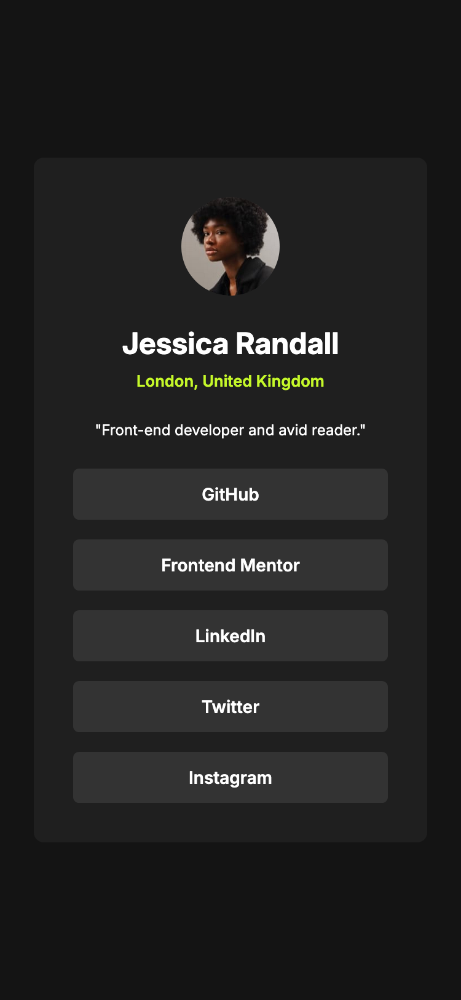

# Frontend Mentor - Social links profile solution

This is a solution to the [Social links profile challenge on Frontend Mentor](https://www.frontendmentor.io/challenges/social-links-profile-UG32l9m6dQ). Frontend Mentor challenges help you improve your coding skills by building realistic projects. 

## Table of contents

- [Overview](#overview)
  - [The challenge](#the-challenge)
  - [Screenshot](#screenshot)
  - [Links](#links)
- [My process](#my-process)
  - [Built with](#built-with)
  - [Continued development](#continued-development)
  - [Useful resources](#useful-resources)
- [Author](#author)

## Overview

### The challenge

Users should be able to:

- See hover and focus states for all interactive elements on the page

### Screenshot

### Links

- Solution URL: [Add solution URL here](https://github.com/NathanMartinez/social-links-profile-main)
- Live Site URL: [Add live site URL here](https://nathanmartinez.github.io/social-links-profile-main/)

## My process

### Built with

- Semantic HTML5 markup
- CSS custom properties
- Flexbox
- Mobile-first workflow

### Continued development

I am currently learning about responsive design and accessibility. I plan to focus on improving my understanding of CSS Grid and implementing more accessible design patterns. I also want to explore the use of JavaScript for interactive elements and improve my knowledge of accessibility APIs. I am also interested in learning more about server-side rendering and improving my understanding of performance optimization.

### Useful resources

- [MDN Web Docs](https://developer.mozilla.org/en-US/docs/Web) - MDN Web Docs is an excellent resource for learning about web development. It provides detailed documentation and examples for various web technologies.

## Author

- GitHub - [NathanMartinez](https://github.com/NathanMartinez)
- Frontend Mentor - [@NathanMartinez](https://www.frontendmentor.io/profile/NathanMartinez)
- LinkedIn - [Nathan Martinez](www.linkedin.com/in/nathan-m-145133288)
